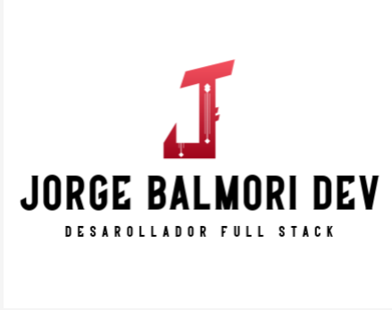

##  Hola, mi nombre es Jorge Balmori Arenas 👋

💬 Soy un desarrollador de aplicaciones web Full Stack con conocimientos en: Spring, Java, Angular, GitHub/GitLab, HTML, CSS, PHP, MySQL.

💬 Soy un apasionado del desarrollo con ganas de aprender y actualizarme constantemente. Estoy abierto a cualquier tipo de oferta laboral.

🤔 Cuento con la titulación de Desarrollador de Aplicaciones Web (Módulo Superior) y un Diploma de Desarrollo de Aplicaciones Empresariales Java realizado en CIC Consulting mediante el Ayuntamiento de Santander.

🤔 Tengo conocimientos medios de inglés tanto escrito como hablado.

📫 Podéis contactarme interesados mediante mi LinkedIn cuyo enlace se encuentra debajo, así como por Gmail o teléfono.

### Contacto

 [LinkedIn](https://www.linkedin.com/in/jorge-balmori-arenas)

📧 [jbalmoriarenas@gmail.com](mailto:jbalmoriarenas@gmail.com)

<!--
**seedpower5/seedpower5** is a ✨ _special_ ✨ repository because its `README.md` (this file) appears on your GitHub profile.

Here are some ideas to get you started:

- 🔭 I’m currently working on ...
- 🌱 I’m currently learning ...
- 👯 I’m looking to collaborate on ...
- 🤔 I’m looking for help with ...
- 💬 Ask me about ...
- 📫 How to reach me: ...
- 😄 Pronouns: ...
- ⚡ Fun fact: ...
-->

